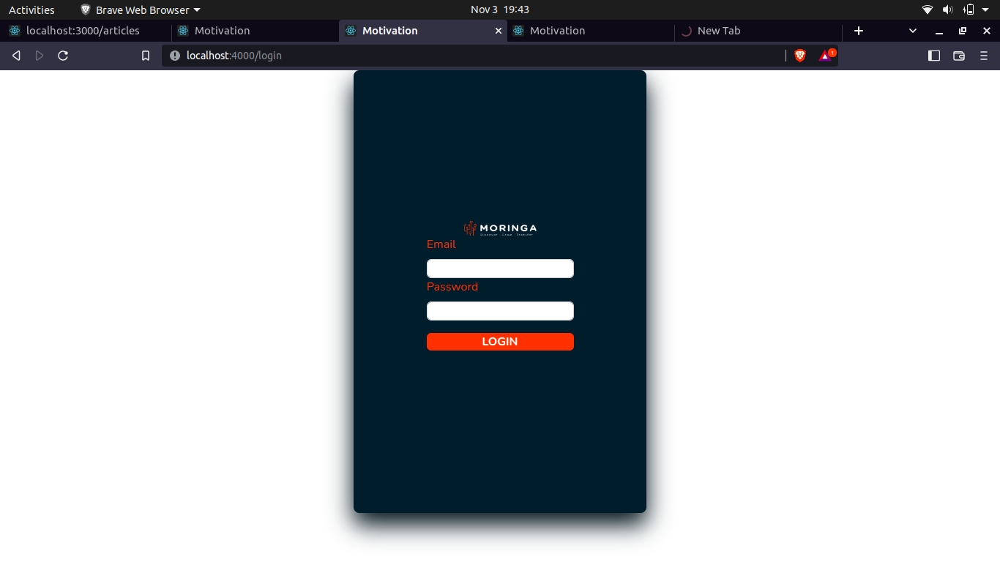
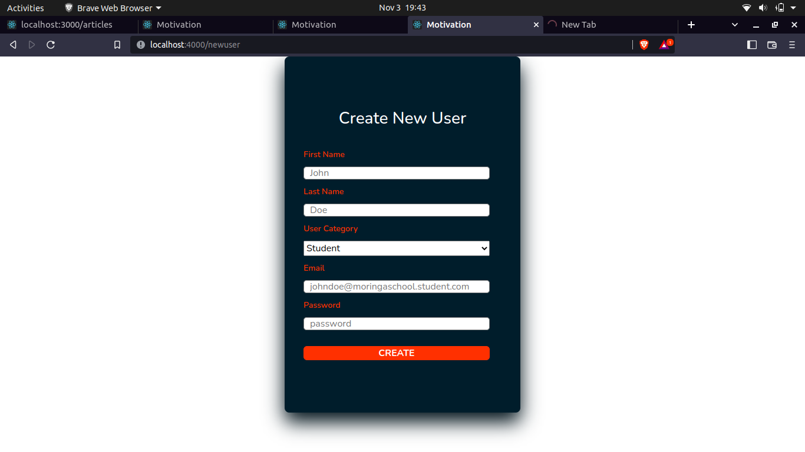

# **Motivation-App**

## **Authors**

    Kelvin Kariuki 
    Livya Kendi 
    Oscar Ochieng
    Peter Atito
    Newton Mboi
    Samuel Mwaura

---

## Project Description

There is dire need to keep the Moringa School Community motivated during and after the bootcamp.   With the intensity of the software development program, it can be easy to burn out or even give up along the way.   Hence the need for a ***motivation app*** to reach the entire community.

---

## Screen shots

### Landing Page
 

### Login Page

### Home Page
 

### Staff Page
 

### Student Page
 

### Admin Page
 

### Creating User Form

### Creating Category Form
 

### Edit User Form
 

---
## Table of content

- [Technologies](#technologies)
- [Description](#description)
- [Features](#features)
- [Setup-process](#setup_process)
- [Project-usage](#project-usage)
- [Licence](#licence)
- [Copyright](#copyright)

---

## Technologies

--- Ruby on Rails

--- HTML and CSS

--- JavaScript (React)

--- PostgreSQL

--- Heroku (deployment)

--- Git and GitHub (version control)

--- Redux

--- Bootstrap

